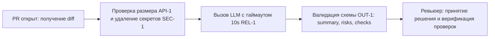

# Анализ процесса: AS IS и TO BE

## AS IS

Текущий процесс ревью:
1. Разработчик открывает PR в репозитории.
2. Ревьюер вручную вычитывает diff, пытаясь одновременно удержать в голове правила безопасности, бизнес-логику и архитектурные ограничения.
3. Ревьюер тратит значительное время на рутинный поиск очевидных проблем (незамаскированные токены, отсутствие обработки ошибок, формат возвращаемых данных).
4. Замечания формулируются в свободной форме (часто без точной привязки к строкам кода или без воспроизводимых проверок).

Точки потери и задержек:
- Высокий человеческий фактор: пропуск секретов в коде при беглом чтении.
- Задержка первого фидбека: ожидание свободного слота ревьюера (от нескольких часов до дней).
- Неструктурированные комментарии вызывают долгие споры в тредах PR.

## TO BE

Процесс с использованием сервиса AI-помощника:
1. При создании/обновлении PR хук или разработчик отправляет diff в сервис `POST /api/reviews`.
2. Сервис проверяет ограничения (API-1: diff < 20 000 символов) и очищает diff от секретов/токенов (SEC-1).
3. Сервис отправляет подготовленный diff с жестким контекстом в LLM с таймаутом 10 секунд (REL-1).
4. Сервис валидирует ответ модели по схеме OUT-1 (summary, ≤3 риска с file:line и цитатами, список проверок).
5. Ревьюер получает готовый структурированный первичный отчёт и сразу видит доказанные риски и шаги их проверки, принимая окончательное решение.

> **Diagram exceeds terminal width (229 > 212 cols)**
> Displayed as code block. Widen terminal to view inline.

## Разница

 Что меняется             | AS IS                                                      | TO BE                                                                   | Как проверим изменение
 --------------------------|------------------------------------------------------------|-------------------------------------------------------------------------|----------------------------------------------
 Безопасность данных      | Секреты могут случайно попасть во внешние сервисы при      | Секреты гарантированно маскируются (SEC-1) до отправки во внешний LLM   | Тест с искусственным токеном в diff:
                           | ручном копировании diff                                    |                                                                         | проверка prompt на отсутствие секрета
 Время первого отклика    | Часы или дни (ожидание инженера)                           | До 10 секунд (автоматический первичный аудит)                           | Замер latency эндпоинта POST /api/reviews
 Формат замечаний         | Размытые замечания («код можно улучшить», без строк и      | Строго до 3 рисков с file:line, цитатой evidence и пошаговым чек-листом | Валидация JSON-схемы ответа сервиса
                           | проверок)                                                  | (OUT-1, QA-1)                                                           |
 Устойчивость к сбоям LLM | Зависание пайплайна или 500 ошибка с трейсом               | Контролируемый ответ (HTTP 503) при таймауте 10 секунд (REL-1)          | Тест с задержкой мока LLM >10 с

## Как использовали AI

- Для чего: Формализация шагов процессов AS IS и TO BE, построение диаграммы Mermaid и таблицы сравнения метрик процессов.
- Тип промпта: RCTF (структурированный запрос на проектирование процесса с ограничениями).
- Строка в [`prompts.md`](prompts.md): P1-02
- Что проверили и исправили сами: Убедились, что в TO BE учтены все правила репозитория (SEC-1, API-1, REL-1, OUT-1, SCOPE-1), а схема отражает точные этапы валидации.
