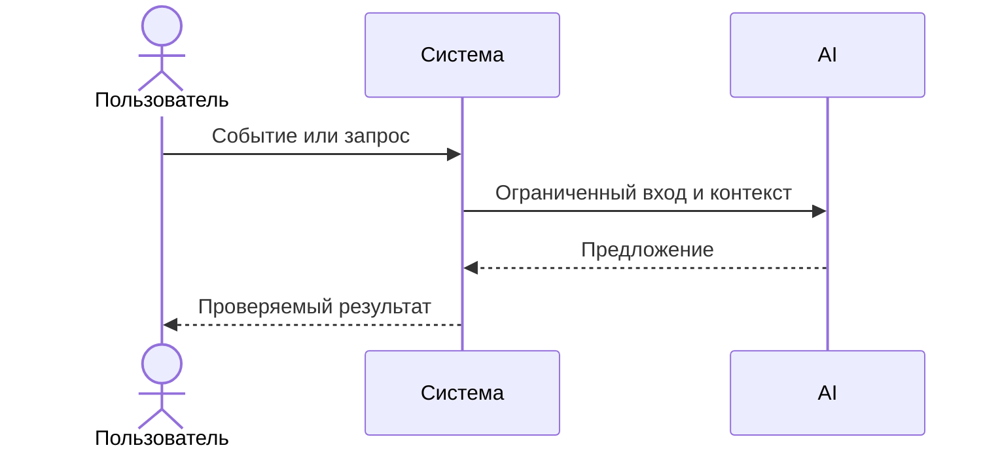

# Use cases и user stories

## Первый рабочий сценарий

**Когда** разработчик отправляет diff PR на ревью через POST /api/reviews, **система** маскирует секреты (SEC-1), запрашивает внешний LLM с таймаутом 10 секунд (REL-1) и валидирует схему ответа, **а пользователь получает** структурированный отчёт (OUT-1) с кратким саммари, до 3 подтверждённых рисков (с file:line и цитатой) и списком воспроизводимых проверок.

Не входит в этот сценарий:

- Автоматический approve или merge PR в GitHub (SCOPE-1).
- Генерация исправленного кода или автоматическое создание коммитов.
- Аутентификация и биллинг пользователей.

## Use case

| Поле | Значение |
|---|---|
| Актор | Инженер-ревьюер или CI-пайплайн |
| Триггер | Отправка diff на анализ через POST /api/reviews |
| Предусловия | Размер diff не превышает 20 000 символов (API-1), сервис доступен |
| Основной результат | JSON-ответ по схеме OUT-1: summary, до 3 рисков с evidence и checks |
| Ошибка или отказ | HTTP 413 при превышении размера; контролируемый HTTP 503 при таймауте LLM >10 с |



```gherkin
Feature: Анализ PR и выявление рисков по правилам репозитория

  Scenario: Успешный анализ diff с выявлением рисков
    Given валидный diff учебного PR размером менее 20 000 символов
    When пользователь отправляет запрос на анализ в POST /api/reviews
    Then система возвращает ответ со структурой summary, risks и checks
    And количество рисков не превышает 3
    And все секреты в diff замаскированы до отправки во внешний LLM

  Scenario: Превышение времени ответа внешнего LLM
    Given внешний LLM недоступен или отвечает дольше 10 секунд
    When пользователь отправляет diff на анализ
    Then сервис прерывает вызов по таймауту 10 секунд
    And возвращает клиенту контролируемый ответ об ошибке без утечки stacktrace
```

## User stories и acceptance criteria

User Story:
Как инженер-ревьюер, я отправляю diff учебного PR в сервис и хочу получить структурированный комментарий с кратким описанием, рисками и списком проверок. Это нужно, чтобы быстро увидеть проверяемые замечания по diff и правилам репозитория и не тратить время на ручной разбор.

Acceptance Criteria (чек‑лист):
- Ответ содержит summary, массив risks (не более 3) и массив checks; у каждого риска есть file, line, evidence, risk [OUT-1]
  Проверка: отправить валидный diff и визуально проверить, что в ответе есть summary, массив checks и в risks ≤3 элементов, каждый с полями file, line, evidence, risk.
- Каждый риск подтверждён строкой из diff и ссылкой на применимое правило репозитория [QA-1]
  Проверка: открыть diff; для каждого риска найти указанные file:line и цитату evidence в diff и убедиться, что в описании риска есть явная ссылка на правило (например, SEC-1/OUT-1/REL-1).
- При превышении 10 секунд ожидания внешнего LLM сервис возвращает контролируемый ответ, без зависания и сырого stacktrace [REL-1]
  Проверка: сымитировать задержку внешнего LLM >10 с и убедиться, что запрос завершился контролируемым ответом (а не 500/таймаут соединения) после срабатывания таймаута.
- Перед отправкой во внешний LLM из diff удаляются/маскируются токены, пароли и приватные ключи [SEC-1]
  Проверка: отправить diff с тестовым token/password/private key и проверить исходящий prompt к LLM: вместо секретов присутствует маска ([REDACTED] или аналогичная).

## Как использовали AI

- Для чего: Декомпозиция сценария ревьюера, формирование критериев приемки (AC) по правилам SEC-1..QA-1 и составление Gherkin-сценариев.
- Тип промпта: RCTF (Role, Context, Task, Format) для генерации BDD-спецификаций.
- Строка в [`prompts.md`](prompts.md): P1-02
- Что проверили и исправили сами: Убедились, что критерии приёмки строго соответствуют правилам из CASE.md, добавили негативный сценарий по таймауту LLM (REL-1).
