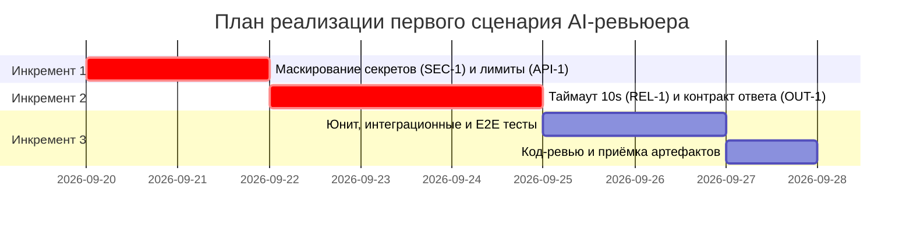

# План поставки

## Инкременты и ответственность

| Инкремент | Наблюдаемый результат | Что делает человек | Что делает AI или субагент | Проверка | Зависимости |
|---|---|---|---|---|---|
| 1. Защита периметра (SEC-1, API-1) | Сервис отклоняет diff > 20k символов (413) и маскирует токены/секреты в diff перед отправкой | Проектирует регулярные выражения/правила маскирования, задаёт контракт | Генерирует функцию очистки секретов и Pydantic-схему запроса | Юнит-тесты на маскирование токенов и лимит размера diff | Базовый каркас FastAPI |
| 2. Интеграция с LLM и контракт ответа (REL-1, OUT-1) | Сервис вызывает LLM с таймаутом 10s, преобразует ответ в JSON (summary, risks ≤3, checks) или возвращает контролируемый 503 | Настраивает обработчик таймаутов, формулирует системный master prompt | Генерирует клиент LLM с таймаутом и парсер схемы ответа OUT-1 | Интеграционный тест с замедленным моком LLM и проверка JSON-схемы | Инкремент 1 |
| 3. Тестовая обвязка и сквозная верификация | Полный набор тестов (unit, integration, load, e2e) и интеграция в CI | Проводит код-ревью тестов, проверяет edge cases | Генерирует моки, фикстуры pytest и сценарии E2E проверок | Успешный прогон pytest и make test | Инкремент 2 |

## Диаграмма Ганта

## Как использовали AI

- Для чего: Декомпозиция поставки на независимые инкременты с чёткими DoD, разделение задач человека и агента, построение диаграммы Ганта в Mermaid.
- Тип промпта: RCTF (планирование спринта и инкрементов с ограничениями).
- Строка в [`prompts.md`](prompts.md): P1-02
- Что проверили и исправили сами: Убедились, что в инкрементах первыми закрываются критические риски безопасности (SEC-1) и стабильности (REL-1), а диаграмма Ганта отражает реальные зависимости задач
